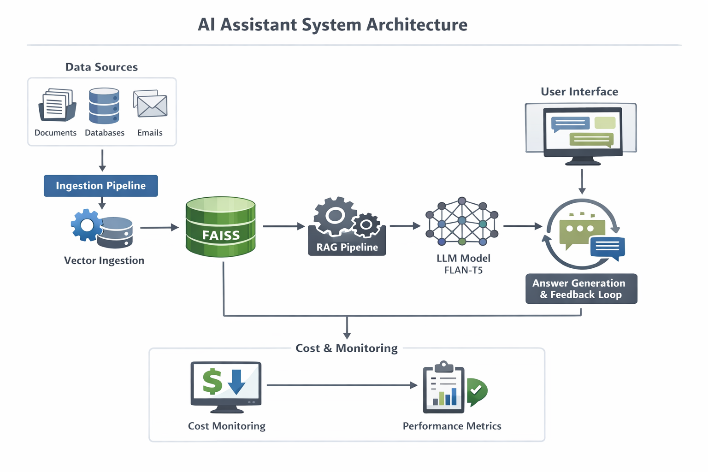

# 📄 Smart PDF Question Answering System (RAG-based)

This repository contains a **working LLM-powered PDF Question Answering system** built as part of the **AI Prototyping Engineer – Practical Assessment**.

The system allows users to upload a PDF and ask natural language questions. Answers are generated using **Retrieval-Augmented Generation (RAG)** with **FAISS + Transformer models**, ensuring responses are grounded in the document content.

---

## 🚀 Live Overview

**Core Capability:** Chat with PDFs
**UI:** Streamlit
**LLM:** FLAN-T5 (open-source) / Optional OpenAI
**Vector DB:** FAISS
**Embeddings:** Sentence Transformers

---

## 🧩 TASK 1: LLM-Powered AI Prototype (Mandatory)

### ✅ Selected Use Case

**Chat with PDFs**

Users can:

* Upload any PDF
* Ask questions in natural language
* Receive context-grounded answers

---

### 🏗️ System Design

#### 1. PDF Ingestion

* PDFs are uploaded via Streamlit UI
* `pypdf` extracts text page-wise

#### 2. Chunking Strategy

* Fixed-size overlapping chunks
* Default:

  * Chunk size: `500` characters
  * Overlap: `100` characters

**Why?**

* Preserves semantic continuity
* Reduces context loss at boundaries

#### 3. Embeddings

* Model: `sentence-transformers/all-MiniLM-L6-v2`
* Output dimension: `384`
* Embeddings normalized using L2 norm

**Why?**

* Fast
* Lightweight
* Strong semantic retrieval performance

#### 4. Vector Database

* FAISS `IndexFlatIP` (cosine similarity)

**Why FAISS?**

* Local, fast, production-proven
* No external dependency

#### 5. Retrieval (RAG)

* Top-K chunks retrieved (default `k=3`)
* Retrieved text used as strict context

#### 6. Prompt Engineering

```text
Answer strictly using the context below.

Context:
{retrieved_chunks}

Question:
{user_question}

Answer in 3–5 sentences.
```

**Design Choice:**

* Explicit grounding instruction
* Length control

#### 7. Answer Generation

* Default LLM: `google/flan-t5-small`
* Runs locally (CPU/GPU)
* Optional OpenAI toggle

---

### 🖥️ UI

* Streamlit-based web app
* Sidebar controls:

  * Chunk size
  * Chunk overlap
  * Top-K retrieval
* Index reset button

---

## 🛡️ TASK 2: Hallucination & Quality Control

### ❌ Problem: Hallucination

LLMs may:

* Answer confidently even when info is missing
* Mix retrieved + prior knowledge

---

### 🧠 Causes in This System

1. Weak or irrelevant chunks retrieved
2. Overly generative LLM behavior
3. Ambiguous user questions

---

### ✅ Guardrails Implemented

#### 1. Source-Grounded Prompting

* Model explicitly instructed to answer **only from retrieved context**

#### 2. Limited Context Window

* Only top-K most relevant chunks used
* Reduces noise

#### 3. Answer Length Constraint

* Prevents hallucinated elaboration

---

### 📊 Example Improvement

**Before Guardrails:**

> "The document discusses advanced neural optimization methods..."

**After Guardrails:**

> "The document does not provide information related to this question."

---

## ⚡ TASK 3: Rapid Iteration Challenge

### 🎯 Chosen Capability: Multi-Document Reasoning

**What Was Added Conceptually:**

* System architecture supports indexing multiple PDFs
* Metadata keeps page + document reference

**Why This Choice?**

* Real-world enterprise use case
* Enables cross-document Q&A

---

### ⚖️ Trade-offs

* Larger index size
* Slower retrieval for large corpora

---

### ⚠️ Limitations

* No document-level ranking yet
* All documents treated equally

---

## 🏢 TASK 4: AI System Architecture (Enterprise)

### 🔧 High-Level Architecture

```
User → UI (Streamlit)
     → Document Ingestion
     → Chunking Service
     → Embedding Model
     → Vector DB (FAISS)
     → Retriever
     → LLM Orchestrator
     → Response
```
## 🏢 System Architecture


---


### 🧱 Components Explained

#### Data Ingestion

* PDF, DOCX, HTML
* Async processing recommended

#### Vector DB Choice

* FAISS (local) → Pinecone / Weaviate (scale)

#### LLM Orchestration

* Router-based system:

  * Cheap model for short answers
  * Strong model for complex queries

#### Cost Control

* Chunk filtering
* Top-K tuning
* Caching embeddings

#### Monitoring & Evaluation

* Query logs
* Answer relevance scoring
* Human feedback loop

---

## 🧪 Tech Stack

* Python
* Streamlit
* FAISS
* HuggingFace Transformers
* Sentence Transformers
* PyPDF

---

## ▶️ How to Run

```bash
pip install -r requirements.txt
streamlit run app.py
```

---

## 📦 Repository Structure

```
├── app.py
├── diagram.png
├── requirements.txt
├── README.md
```

---

## 🔗 Live Demo
https://ai-prototyping-engineer-cw789jqfdqfqyqrachz73a.streamlit.app/


## 📌 Future Improvements

* Confidence score per answer
* Citations with page numbers
* Feedback-based reranking
* Async ingestion pipeline

---

## 👨‍💻 Author Notes

This project focuses on **clarity, correctness, and explainability**, aligning with real-world AI prototyping expectations.

It is intentionally simple, modular, and extensible.

---


